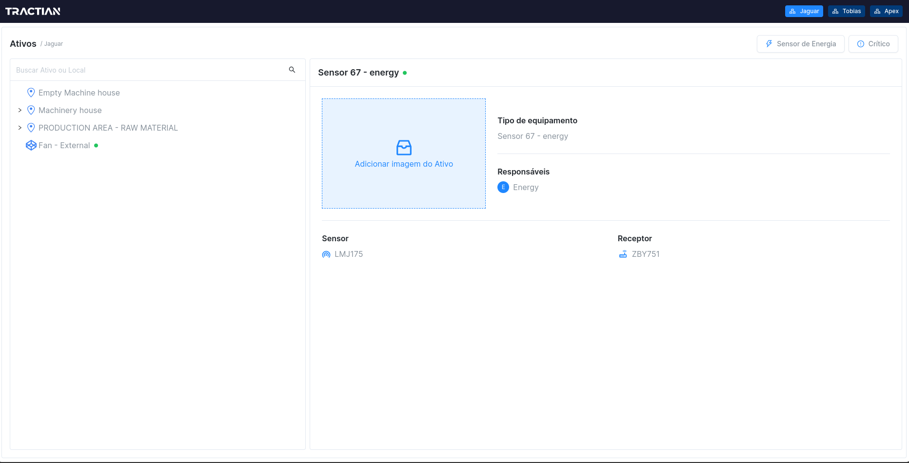
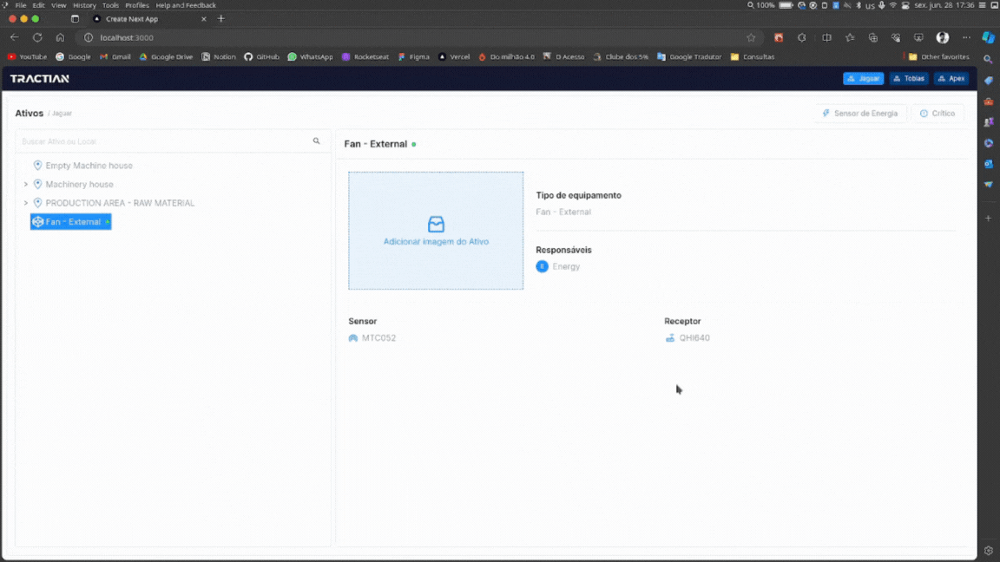

<h2 align="center">
  
</h2>

<h1 align="center">
    Front End Software Engineer
</h1>

 Build an Tree View Application that shows companies Assets (The tree is basically composed with components, assets and locations)
 

<h1 align="center">
  
</h1>

<h2 id="technologies"> 🛠 Technologies </h2>

The following tools were used in the construction of the project:

- [TailwindCSS](https://tailwindcss.com/)
- [NextJS](https://nextjs.org/)
- [ReactJS](https://reactjs.org)
- [NodeJS](https://nodejs.org/en/)
- [Yarn](https://yarnpkg.com) or Npm
- [VSCode](https://code.visualstudio.com)
- [Git Bash](https://gitforwindows.org/)

<h2 id="author"> 💻 Author </h2>

By Rodrigo Santos 👋🏽 Find me:

|

<h2 id="demo"> 🎌 Demo </h2>

<h1 align="center">
  

    
  

</h1>

<h2 id="license"> 📝 License </h2>

This project is under the MIT license.
